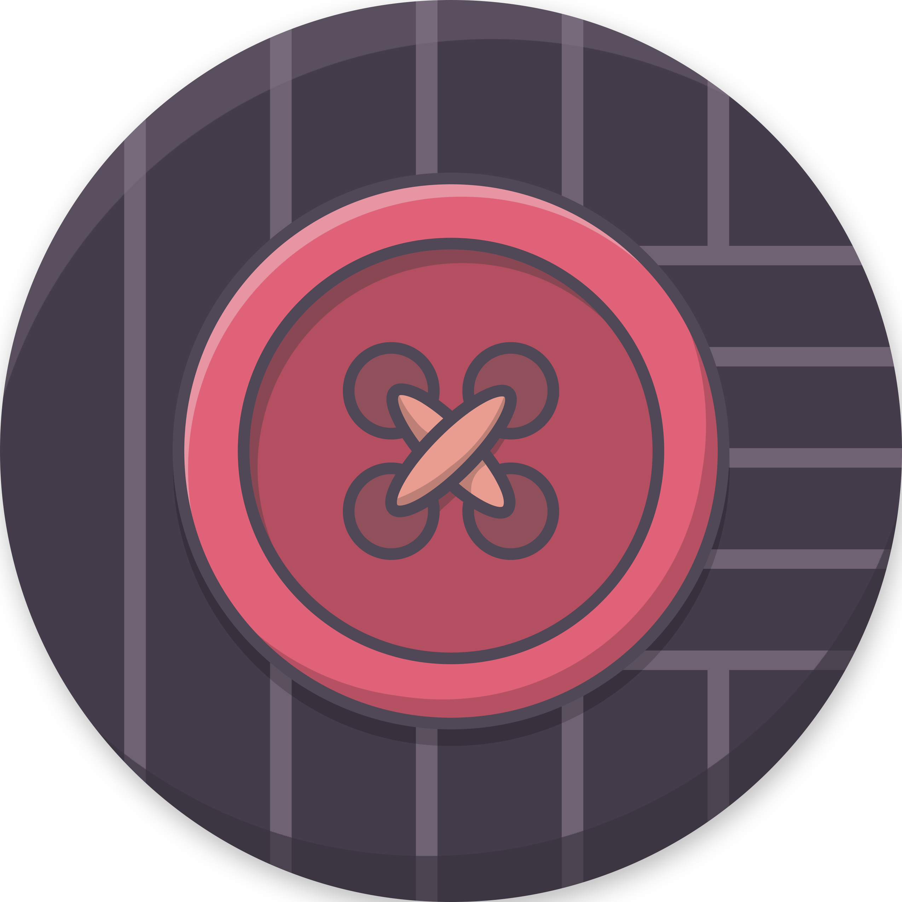
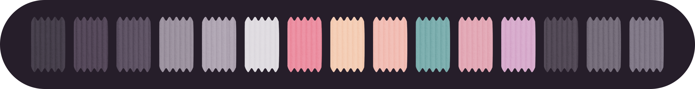
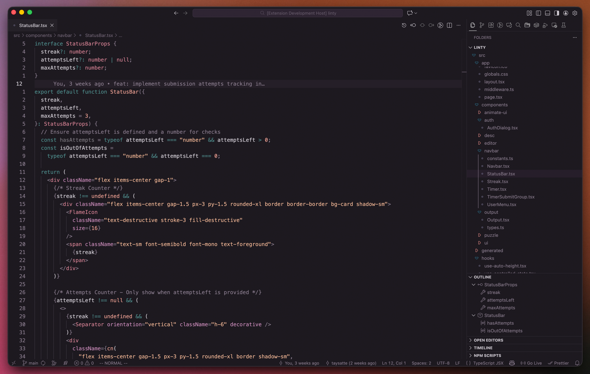
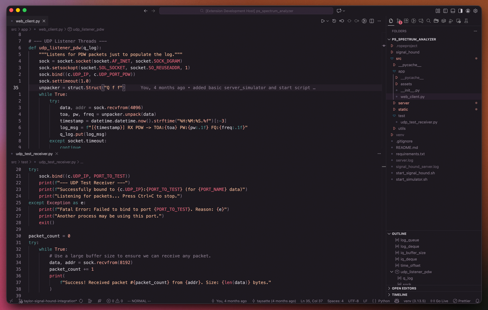
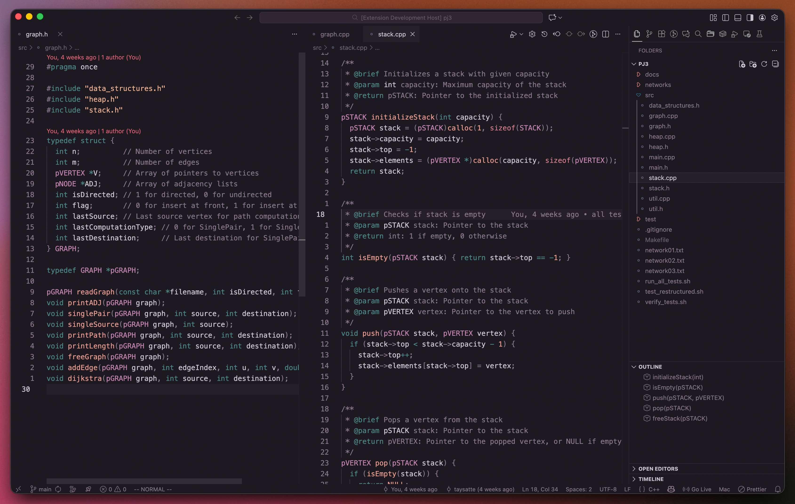

<div align="center">



<br />

# Corduroy for Visual Studio Code

**Embrace vintage warmth, soft textures, and a touch of retro flair**



<br />
<br />

[](https://marketplace.visualstudio.com/items?itemName=TaylorSattenfield.corduroy-theme-vscode)
&nbsp;&nbsp;
[](https://marketplace.visualstudio.com/items?itemName=TaylorSattenfield.corduroy-theme-vscode)

</div>

## 📦 Installation

### VS Code Marketplace

1. Open **Extensions** sidebar (`Ctrl+Shift+X` / `Cmd+Shift+X`)
2. Search for **`Corduroy`**
3. Click **Install**
4. Open **Command Palette** (`Ctrl+Shift+P` / `Cmd+Shift+P`)
5. Type `Preferences: Color Theme` and select **Corduroy**
6. Enjoy the cozies! ☕️

### Command Line

```bash
code --install-extension TaylorSattenfield.corduroy-theme-vscode
```

## 🎨 Gallery

### TypeScript



### Python



### C++



---

<div align="center">

**Made with ☕️ and 🧵 by [Taylor Sattenfield](https://github.com/taysatte)**

[⭐ Star this repo](https://github.com/taysatte/corduroy-theme-vscode) • [🐛 Report Bug](https://github.com/taysatte/corduroy-theme-vscode/issues) • [💡 Request Feature](https://github.com/taysatte/corduroy-theme-vscode/issues)

</div>
